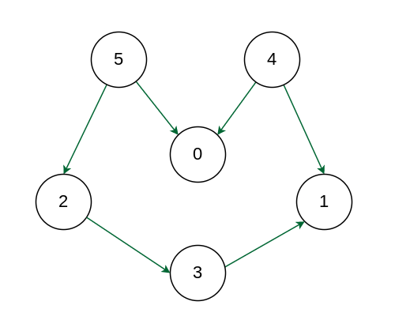
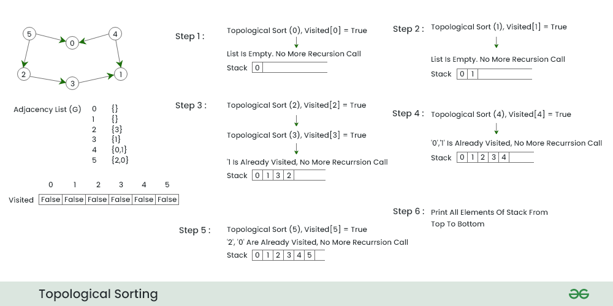

**Topological sorting** for Directed Acyclic Graph (DAG) is a linear ordering of vertices such that for every directed edge u-v, vertex u comes before v in the ordering.

**Note:** Topological Sorting for a graph is not possible if the graph is not a ***\*DAG\****.

**Input:**



**Output:** *5 4 2 3 1 0*
**Explanation:** The first vertex in topological sorting is always a vertex with an **in-degree** of 0 (a vertex with no incoming edges). A topological sorting of the following graph is **“5 4 2 3 1 0”**. There can be more than one topological sorting for a graph. Another topological sorting of the following graph is **“4 5 2 3 1 0”**.




## Code

```C++
void topologicalSort(int numNode, vector<vector<int>> adj_vect){
	vector<bool> isVisited(numNode, false);
    vector<int> indegree_count(numNode, 0);
    
    // loop for numNode = adj_vect.size() 
    for(int i=0; i<adj_vect.size(); i++){
        // loop for neighbours of each node
        for(auto neighbour:adj_vect[i]){
            indegree_count[neighbour]++;
        }
        
        // The following line is wrong because
        // by definition, numOfDegree of node is equal to number of incoming edge
        // while the following line is the outcoming edge of each node
        // indegree_count[i] = adj_vect[i].size();
    }

	queue<int> toBeVisited;
    for(int j=0; j<adj_vect.size(); j++){
        if(indegree_count[j]==0){
            toBeVisited.push(j);
        }
    }

    vector<int> topological_sort; 
    while(!toBeVisited.empty()){
        int node = toBeVisited.front();
        toBeVisited.pop();
        topological_sort.push_back(node);

        for(auto it: adj_vect[node]){
            indegree_count[it]--;
            if(indegree_count[it]==0){
                toBeVisited.push(it);
            }
        }
    }
    
    return topological_sort;
}
```

